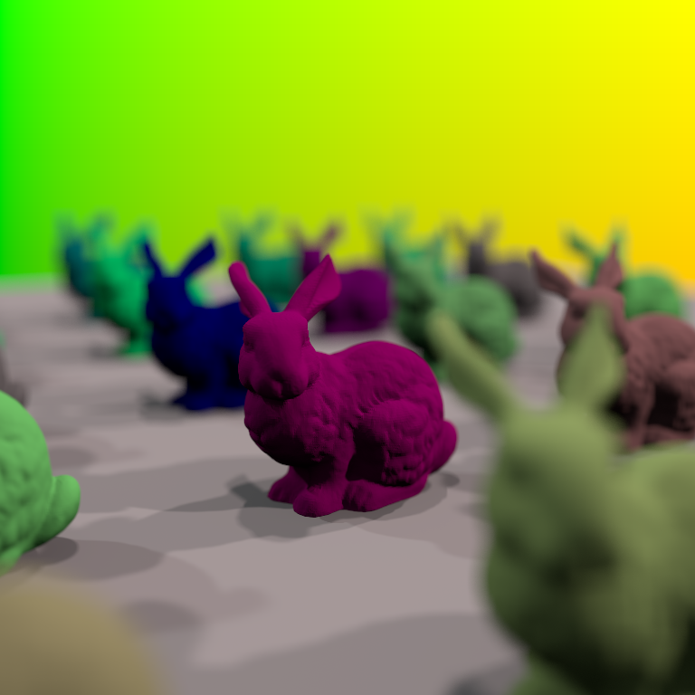

# OptiX Raytracer

Programming a Raytracer using NVIDIA's OptiX framework.

## Status

This project is in a very early stage. It uses mainly OptiX SDK tools (mainly `sutil`).

It contains all OptiX SDK samples. The [`imgui_test`](SDK/imgui_test) sample is my current playground.
The above image was created using this project.
